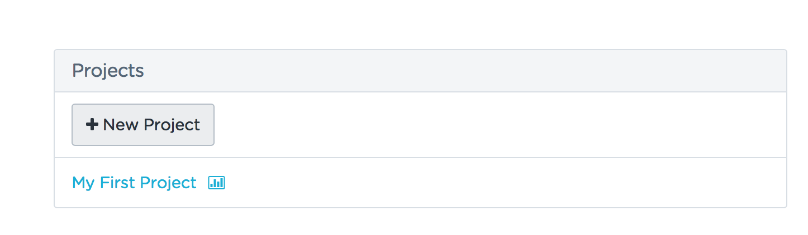
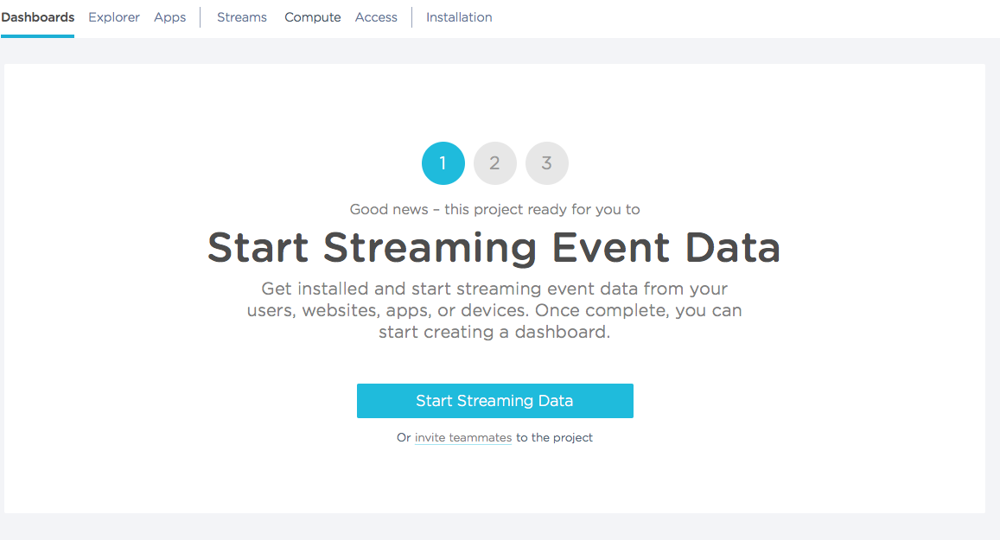
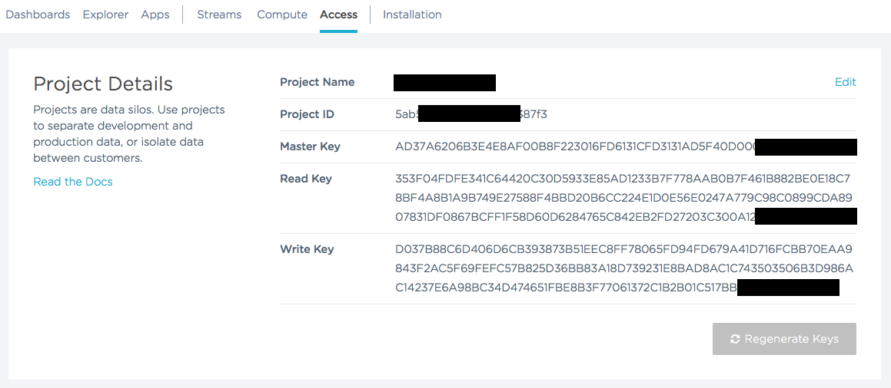

# Introduction to Analytics

Analytics is instrumenting your product(s) and using the resulting data to discover insights about the product(s), their customers and users, and their usage.

The general process for Analytics is:

1. Capture Events (to a database) - Event Recording
1. Query & Analyze Data
1. Visualize Event Data
1. Apply models to event data (e.g., funnel)

Really, there's a zeroth step - Identify Goals - what are we trying to improve with analytics (user experience?, sales funnel conversion rates?, user engagement?).  And, it is a never-ending cycle - there are always aspects of your system that can be improved.

The implied last step is to discover insights and then translate those insights into actions (e.g., improving user experience to improve sales funnel conversion).

## Capturing Data

Deciding what data to capture can be tricky - data that might not seem relevant right now often needs to be captured so that you have it in the future "just in case" - you will not have another opportunity, so you might as well capture it.  For instance, you might not have any particular need for the geographic locations of your Web users right now, but it is entirely conceivable in a few months that you might want to look at current site usage by geography and the trends over time.  So, you better capture the location (as well as access time, web browser version, operating system version, referrer page, etc.) now while you can.

Analytics for Web sites, and, more recently, mobile applications, are pretty well developed at this point - there are many tools out there.

Connected Devices raise the complexity bar for analytics (and business overall).  Integrating Web and Mobile analytics data and analysis is complicated - adding a large number of embedded devices, connected over WiFi, Bluetooth, etc., integrating data capture into those products, accessing the captured data, and integrating that data with your Web and Mobile data for insights requires lots of planning.

While you can build your own analytics system, and store event data in your own database, query it, etc., the quality and number of analytics platforms available make it hard to justify building your own solution.  The platforms have front-ends designed for massive, large scale event data ingestion, and back-ends optitmized for rapid querying and analysis, as well as support for multiple languages (JavaScript, Ruby, Python, iOS, etc.) and platforms (browsers, iOS, Android, etc.).

## Analysis

An infinite number of queries and analysis can be performed on Analytics data, depending on the organization, product, goals, etc.  Nearly all, though, are based on some segment of time (e.g., "today", "the last 24 hours", "the last week", etc.) or comparing data for different time frames (e.g., "the last week versus the previous week" or "this year to date, versus last year to the same date").

A very common analysis is "Page Views" - how many HTML pages did we serve up in the last hour, day, week, etc.  "Unique Visitors" is also common - how many different people visited our site during a particular time frame.

### Funnels

A very common analysis model is a "funnel" or flow, typically broken down into discrete user actions/steps, such as:

1. Landing Page
1. Search for a Product
1. Add Product to Shopping Cart
1. Start Checkout
1. Complete Checkout (Purchase Something)

Obviously, if we're an online merchant, we drive revenue primarily when people complete the last step "Complete Checkout" and we want the largest number of people as possible hitting the "top" of the funnel ("Landing Page") and the largest percentage of those people as possible to buy something ("Complete Checkout") but invariably people "fall-out" at various steps.  Sometimes it is because they decide the product is not worth the price.  Other times, though, it is because they just get confused on the site, or give up because it is too complicated.  Funnel analyis is how we monitor the flow and seek to improve "conversion rates".  

Funnels are not only useful for e-commerce, but for any crtical flow.  [A/B Testing](https://en.wikipedia.org/wiki/A/B_testing) is frequently performed within the context of a funnel analysis - at a particular stage of the funnel that the team is working to improve, two (or more) variants of the page ("A" variant, "B" variant, etc.) are created to test hypotheses of what might improve conversion to the next stage.  Users are randomly assigned to one group or the other.  The analytics results can then help the team understand if "A" or "B" worked better (or, depressingly frequently) that they performed the same. 

## Analytics Platforms

There are a huge number of analytics platforms we could choose from, noting that we have a couple requirements to fulfill:

* For the purpose of this class, there needs to be an offering with a free tier.
* Must have Python and Objective-C clients.
* Needs to not be singularly focused on web, mobile, etc. We are logging from all of our devices and endpoints.

Here are some other potential platforms, some more specialized than others:

* [PIWIK](http://piwik.org)
* [Google Analytics](https://www.google.com/analytics/)
* [Splunk](http://www.splunk.com)
* [Loggly](https://www.loggly.com)

## Getting Started with Keen.io

Given the course needs, we will be working with [Keen.io](https://keen.io). Keen.io is a general purpose analytics solution with support for a [wide range of platforms and languages](https://keen.io/product/).

### Signing Up

Navigate to [Keen.io](https://keen.io) and click **Sign Up Free**. You can create an account or sign in with your GitHub account.

### Creating a New Project

Once you are logged in, navigate to **Home** and under **Projects** click **New Project**. Name your project "LAMPI" and click **Add Project**.

You should now be at the project overview page.  Click **Dashboard** on the top-left of the page.

Keen uses a few credentials for recording and querying events:

* Project ID - random, unique string of characters to identify a project
* Read Key - long, random string of characters granting access to Read (Query) data in a Project
* Write Key - long, random string of characters granting access to Write (Record) event data in a Project

You can find these credentials (access tokens) on the **Access** page:

Most of the Software Development Kits (SDKs) for clients to connect will need the **Project ID** and either the **Read Key** or the **Write Key**.

Next up: [10.2 Logging an Analytics Event](../10.2_Logging_an_Analytics_Event/README.md)

&copy; 2015-18 LeanDog, Inc. and Nick Barendt
