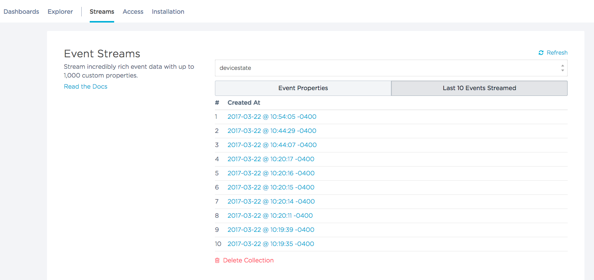
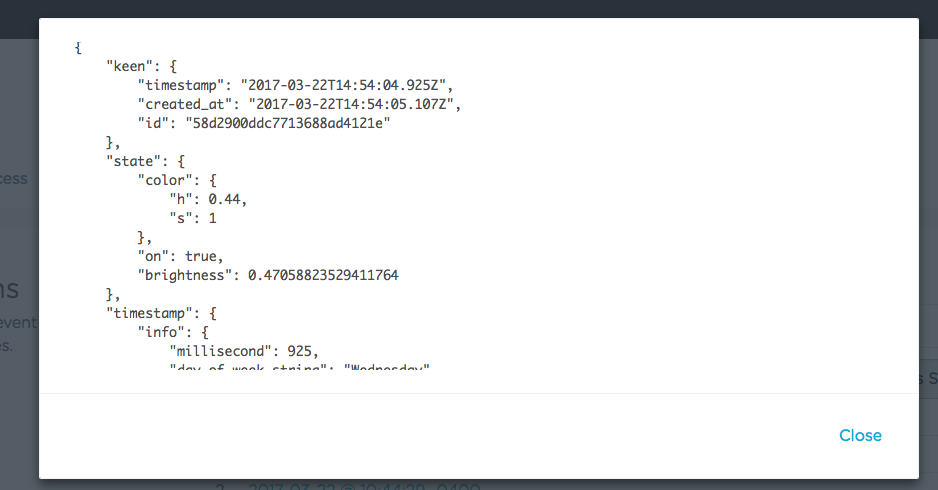
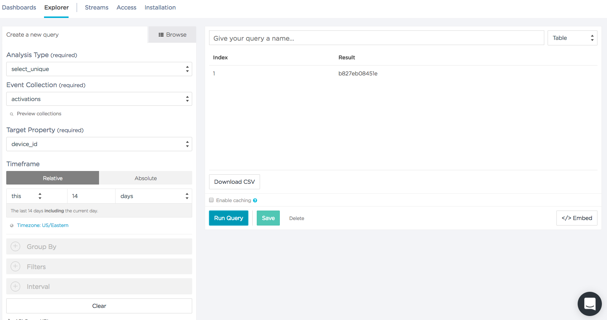

# Logging an Analytics Event

Let's start gathering analytics events. We'll do this from our EC2 instance. There may be events specific to mobile, the Kivy UI, or the webpage we want to capture, but for right now we'll focus on changes to the lamp state.  We will modify the `mqtt-daemon` Django management command to create Keen Events when lamp state changes.

Log into your EC2 instance and install the Keen python module:

## Installing Keen's Python Library

```bash
cloud$ sudo pip3 install keen
```

## Keen Analytics Event Recorder

To keep our core analytics code for our web site in one place, let's create a new file **analytics.py** in **Web/lampisite/lampi/management/commands/** (same directory as **mqtt-daemon.py**.

```python
import datetime
import keen

class KeenEventRecorder:
    def __init__(self, keen_project_id, keen_write_key):
        keen.project_id = keen_project_id
        keen.write_key = keen_write_key

    def record_event(self, collection, event_dict):
        e = self._build_default_keen_event()
        e.update(event_dict)
        keen.add_event(collection, e)

    def _build_default_keen_event(self):
        return {
            'keen': {
                'timestamp': datetime.datetime.now().isoformat(),
                'addons': [
                    {
                        'name': 'keen:date_time_parser',
                        'input': {
                            'date_time': 'keen.timestamp',
                        },
                        'output': 'timestamp.info',
                    },
                ]
            },
            }
```

Our new class `KeenEventRecorder` takes a **Project ID** and an associated **Write Key** in its constructor.

It has a `record_event()` function, which takes a Keen collection name (a String) and an Event Record dictionary.  It uses another function `_build_default_keen_event()` to create a default event dictionary with a Keen `timestamp` and one Keen addon, the [Datetime Parser](https://keen.io/docs/api/#datetime-parser) which separates the `timestamp` property into separate properties that make some analysis queries easier later.  We have more to say about add-ons below (see [Data Enrichment](https://keen.io/docs/streams/data-enrichment-overview/)).  The `event_dict` provided is then "added" to the default dictionary, and then the `keen.add_event()` method is called to add the event to the specified collection (which results in the Keen library making a series of HTTP calls to the Keen servers).

Unsurprisingly, the event dictionary is eventually converted to JSON as it is passed to Keen.  JSON does not have a convenient date/time primitive type, so Keen and many other systems store dates and times in JSON Strings, often using the [ISO-8601](https://en.wikipedia.org/wiki/ISO_8601) format.  Python makes that easy with the [`isoformat()`](https://docs.python.org/2/library/datetime.html#datetime.date.isoformat) method of the `datetime` object.

## Updating `mqtt-daemon.py` for Keen

Modify **mqtt-daemon.py** To include Keen and monitor lamp state:

```python
import re
from paho.mqtt.client import Client
from django.contrib.auth.models import User
from django.core.management.base import BaseCommand
from django.conf import settings
from lampi.models import *
from .analytics import KeenEventRecorder


PROJECT_ID = 'FILL IN WITH YOUR PROJECT ID'
WRITE_KEY = 'FILL IN WITH YOUR WRITE KEY'

MQTT_BROKER_RE_PATTERN = ('\$sys\/broker\/connection\/'
                          '(?P<device_id>[0-9a-f]*)_broker/state')
DEVICE_STATE_RE_PATTERN = r'\/devices\/(?P<device_id>[0-9a-f]*)\/lamp\/changed'

def device_association_topic(device_id):
    return '/devices/{}/lamp/associated'.format(device_id)


class Command(BaseCommand):
    help = 'Long-running Daemon Process to Integrate MQTT Messages with Django'

    def _create_default_user_if_needed(self):
        # make sure the user account exists that holds all new devices
        try:
            User.objects.get(username=settings.DEFAULT_USER)
        except User.DoesNotExist:
            print("Creating user {} to own new LAMPI devices".format(
                settings.DEFAULT_USER))
            new_user = User()
            new_user.username = settings.DEFAULT_USER
            new_user.password = '123456'
            new_user.is_active = False
            new_user.save()

    def _on_connect(self, client, userdata, flags, rc):
        self.client.message_callback_add('$SYS/broker/connection/+/state',
                                         self._device_broker_status_change)
        self.client.subscribe('$SYS/broker/connection/+/state')
        self.client.message_callback_add('/devices/+/lamp/changed',
                                         self._monitor_lamp_state)
        self.client.subscribe('/devices/+/lamp/changed')

    def _create_mqtt_client_and_loop_forever(self):
        self.client = Client()
        self.client.on_connect = self._on_connect
        self.client.connect('localhost', port=50001)
        self.client.loop_forever()

    def _device_broker_status_change(self, client, userdata, message):
        print("RECV: '{}' on '{}'".format(message.payload, message.topic))
        # message payload has to treated as type "bytes" in Python 3
        if message.payload == b'1':
            # broker connected
            results = re.search(MQTT_BROKER_RE_PATTERN, message.topic.lower())
            device_id = results.group('device_id')
            try:
                device = Lampi.objects.get(device_id=device_id)
                print("Found {}".format(device))
            except Lampi.DoesNotExist:
                # this is a new device - create new record for it
                new_device = Lampi(device_id=device_id)
                uname = settings.DEFAULT_USER
                new_device.user = User.objects.get(username=uname)
                new_device.save()
                print("Created {}".format(new_device))
                # send association MQTT message
                new_device.publish_unassociated_msg()
                # record a new activation
                evt = {'device_id' : device_id, 'user': new_device.user.username}
                self.keen.record_event('activations', evt)

    def _monitor_lamp_state(self, client, userdata, message):
        results = re.search(DEVICE_STATE_RE_PATTERN, message.topic.lower())
        device_id = results.group('device_id')
        evt = {'device_id' : device_id}
        evt['state'] = json.loads(message.payload.decode('utf-8'))
        self.keen.record_event('devicestate', evt)

    def handle(self, *args, **options):
        self.keen = KeenEventRecorder(PROJECT_ID, WRITE_KEY)
        self._create_default_user_if_needed()
        self._create_mqtt_client_and_loop_forever()
```

The `KeenEventRecorder` instance is created in the `handle()` method.

The `_monitor_for_new_devices()` method has been augmented to record an event to the "activations" Keen collection whenever a new device connects the first time - we store the device ID and the username (later, when the user associates the device with their account, a new Event can be recorded)`:

```python
                # record a new activation
                evt = {'device_id' : device_id, 'user': dev.user.username}
                self.keen.record_event('activations', evt)
```

We have also added a new MQTT Subscription ("/devices/+/lamp/changed") and handler to listen for all device lamp state changes:

```python
    def _monitor_lamp_state(self, client, userdata, message):
        results = re.search(DEVICE_STATE_RE_PATTERN, message.topic.lower())
        device_id = results.group('device_id')
        evt = {'device_id' : device_id}
        evt['state'] = json.loads(message.payload.decode('utf-8'))
        self.keen.record_event('devicestate', evt)
```

We extract the device ID from the topic with the regex, an create and Event record with the device ID and device state (e.g., hue, saturation, brightness, on/off).  Note: Python3 distinguishes between String (`str`) and Byte arrays (`bytes`) - `json.loads()` requires the input to be a string, but the MQTT payload is a  byte array - we can decode that byte array to a UTF-8 string with the `.decode('utf-8')`.  See [Python Unicode HOWTO](https://docs.python.org/3/howto/unicode.html) for more information.

To get your **Project ID** and **Write Key**, navigate back to [Keen.io](https://keen.io), and select **Access**.  


Copy the values from the web page into the constants a the top of the **mqtt-daemon.py** file. 

You can stop `mqtt-daemon` in supervisor:

```bash
$cloud sudo supervisorctl stop mqtt-daemon
```

and run it manually while you're developing it:

```
$cloud cd ~/connected-devices/Web/lampisite
$cloud ./manage.py mqtt-daemon
```

Once it's running, press the power button on the LAMPI touchscreen a couple times. 

Navigate back to [Keen.io](https://keen.io) and navigate to your project dashboard. Under **Streams**, "devicestate" should now appear in the drop-down as an option ("Streams" are equivalent to "Collections". Select it and you should see an event for each time you pressed power. Events may take a couple minutes to appear.



Click on a single event and you can see the user data you provided (`on`):



To see the activations event, halt mosquitto on your pi:

```bash
$lamp sudo service mosquitto stop
```

Use the Django Admin to delete any LAMPI devices in the database.

Make sure the `mqtt-daemon` is running.  Then, start mosquitto back up on the pi

```bash
$lamp sudo service mosquitto start
```

You should be able to use **Streams** to see your "activations" collection and a single record.

## Keen Query Explorer

You can use the **Explorer** interface in [Keen.io](https://keen.io) to perform interactive queries on your data.  For instance, you can generate a table of device IDs that have been activated within the last two weeks:

* Analysis Type - "select\_unique"
* Event Collection - "activations"
* Target Property - "device\_id"
* Timeframe - Relative, "this", 14 days

Press "Run Query".  You change the output format from Table to JSON (other analysis types support additional formats).



## Data Enrichment

Keen supports several "add-ons" for [Data Enrichment](https://keen.io/docs/api/#data-enrichment).  Most of them are convenience functions, to break down HTTP headers into more easily queryable formats:

* [User Agent parser](https://keen.io/docs/api/#user-agent-parser) - split up the User Agent (Browser) string into easily queryable properties
* [URL parser](https://keen.io/docs/api/#url-parser) - split up a URL (like the current page URL) string into easily queryable properties
* [Referrer parser](https://keen.io/docs/api/#referrer-parser) - split up the referrer information into easily queryable properties to understand where users are coming from when they arrive at a page on our site
* [Datetime parser](https://keen.io/docs/api/#datetime-parser) - split up a date/time timestamp into Year, Month, Date, Hours, Minutes, Seconds, etc., and day of the week

One add-on, however, [IP to Geo parser](https://keen.io/docs/api/#ip-to-geo-parser), adds some additional and otherwise somewhat hard to capture data into event records.  It takes the IP address of the client and uses a Keen database to map IP address ranges to physical locations, allowing Keen to determine an approximate location of the client computer.  This is no substitute for the accuracy of a GPS position, but is generally good enough to localize the client IP to a ZIP Code.  Note:  the IP used is the address of the client connecting to [Keen.io](http://keen.io), so if a user's browser is running on a computer behind a NAT device (like a home cable modem), the IP address of the NAT device will be used.  That's generally a good thing, since typical home subnets (e.g., 192.168.1.XXX) are not unique (or routable, for that reason).

The way these add-ons are used is that they are added to an event record, specifying some input and output properties, and when Keen ingests event records containting add-ons, it processes and "enriches" the event record before the record is stored in Keen's database.

The [User Agent parser](https://keen.io/docs/api/#user-agent-parser), [URL parser](https://keen.io/docs/api/#url-parser), and [Referrer parser](https://keen.io/docs/api/#referrer-parser) are generally most useful in the context of instrumenting website pages.

The [Datetime parser](https://keen.io/docs/api/#datetime-parser) and [IP to Geo parser](https://keen.io/docs/api/#ip-to-geo-parser) are more broadly useful.

We are using the [Datetime parser](https://keen.io/docs/api/#datetime-parser) in the `mqtt-daemon` above.  Why are we not using the [IP to Geo parser](https://keen.io/docs/api/#ip-to-geo-parser)?

Next up: [10.3 Web Analytics](../10.3_Web_Analytics/README.md)

&copy; 2015-18 LeanDog, Inc. and Nick Barendt
