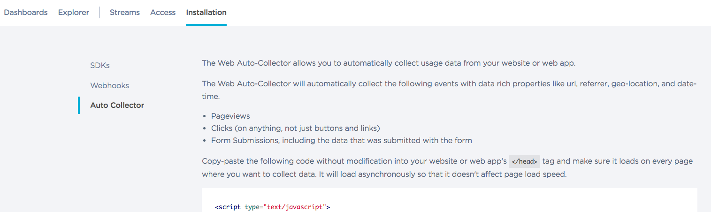

# Web Analytics 

Web analytics are pretty mature at this point, and pretty straight-forward to integrate into your site.  [Keen's](http://keen.io) [Auto Collector](https://keen.io/docs/streams/web-auto-collection/) is trivially easy to use.

In [Keen](http://keen.io) navigate to **Installation** and then to **Auto Collector**:

Follow the instructions to drop the provided code (which will have your **Project ID** and **Write Key** included) into an HTML page.  It will automatically collect pageviews, clicks, and form submissions, with detailed event data.

For more detailed event recording (like our JS/MQTT page to control LAMPI) we need that, plus some additional code.  The code that the Auto Collector uses under the covers is [keen-tracking.js](https://github.com/keen/keen-tracking.js).

Note, particularly:

* [Extending Events](https://github.com/keen/keen-tracking.js/blob/master/docs/extend-events.md)
* [Cookies](https://github.com/keen/keen-tracking.js/blob/master/docs/cookies.md) (different cookies than Django's session cookies, but provides some analogous features)
* [Listeners](https://github.com/keen/keen-tracking.js/blob/master/docs/listeners.md) to easily record events based on HTML UI interactions)

and the [Pageview Example](https://github.com/keen/keen-tracking.js#pageview-tracking).

Next up: [10.4 iOS Analytics](../10.4_iOS_Analytics/README.md)

&copy; 2015-18 LeanDog, Inc. and Nick Barendt
