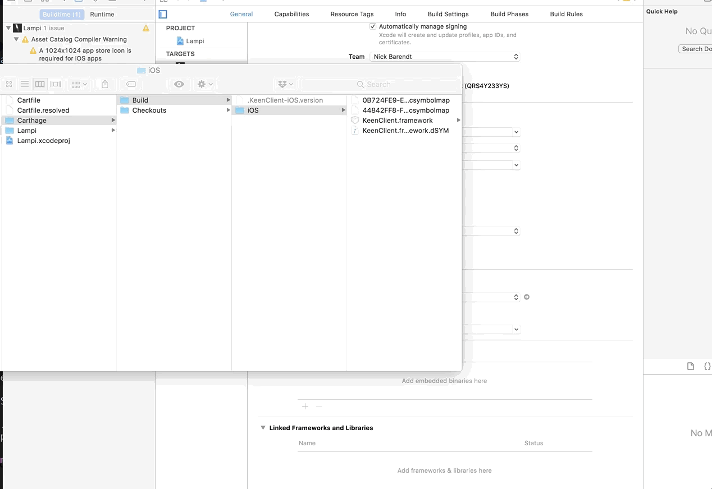
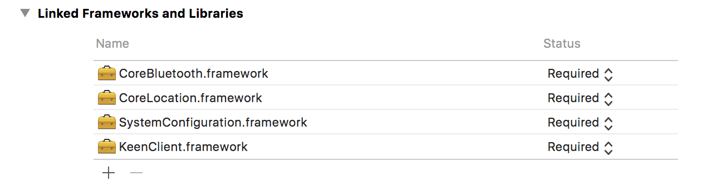

# iOS Analytics 

Keen has [KeenClient-iOS](https://github.com/keenlabs/KeenClient-iOS) library to support analytics event recording on iOS (they also have a [Java / Android](https://github.com/keenlabs/KeenClient-Java) library.

## Installing [KeenClient-iOS](https://github.com/keenlabs/KeenClient-iOS)

Several different ways are provided to [Install](https://github.com/keenlabs/KeenClient-iOS#installation) KeenClient-iOS - we will use the [Carthage](https://github.com/keenlabs/KeenClient-iOS#carthage) solution.

There are several ways to install Carthage - we recommend [Homebrew](https://brew.sh). 

### Install [Homebrew](https://brew.sh)

Open a terminal on OSX and run the following:

```bash
/usr/bin/ruby -e "$(curl -fsSL https://raw.githubusercontent.com/Homebrew/install/master/install)"
```

Update brew's local database (akin go `sudo apt-get update`):

```bash
brew update
```

### Installing [Carthage](https://github.com/Carthage/Carthage)

Install Carthage with brew:

```bash
brew install carthage
```

### Creating a [Cartfile](https://github.com/Carthage/Carthage/blob/master/Documentation/Artifacts.md#cartfile)

From the documentation:

> A Cartfile describes your project’s dependencies to Carthage, allowing it to resolve and build them for you. 

In the directory that contains the XCode project (in our case **connected-devices/Mobile/iOS/Lampi**), create a file named **Cartfile** with the following contents:

```ogdl
github "keenlabs/KeenClient-iOS"
```

then, from the same directory, run:

```bash
carthage update
```

This will download the required libraries and build them (it might take a moment to complete).

## XCode Project Settings

Drag the **KeenClient.framework** from the **Carthage/Build** directory into the **Embedded Binaries** section of the XCode project:



Then add **CoreBluetooth** (if not already there), **CoreLocation**, and **SystemConfiguration** frameworks by selecting them when you click the **+** (add) under **Linked Frameworks and Libraries**.




Be sure to read and follow [Usage](https://github.com/keenlabs/KeenClient-iOS#usage) for creating a `KeenClient` with the appropriate credentials.

Add `#import <KeenClient/KeenClient.h>` to the .m file(s) that need access to the KeenClient-iOS library.

Like all good mobile analytics platforms, Keen automatically supports Geo Location. See [Geo Location and Permissionsin iOS](https://github.com/keenlabs/KeenClient-iOS#requesting-authorization-for-location-in-ios-8).  You will need to modify your applications **plist** file to prompt the user to grant permission to track position while the application is running.  Add [NSLocationWhenInUseUsageDescription](https://developer.apple.com/library/prerelease/content/documentation/General/Reference/InfoPlistKeyReference/Articles/CocoaKeys.html#//apple_ref/doc/uid/TP40009251-SW26) to your application's `plist` (see [here](http://stackoverflow.com/questions/24062509/location-services-not-working-in-ios-8) for additional clues).

**NOTE: Geo Location will not work without doing the above!**

## Adding Events

Event Records in KeenClient-iOS are dictionaries (just like in Python), except that Objective-C uses **NSDictionary** objects:

```Objective-C
  	NSDictionary *event = [NSDictionary dictionaryWithObjectsAndKeys:@"first view", @"view_name", @"going to", @"action", nil];
  	[[KeenClient sharedClient] addEvent:event toEventCollection:@"tab_views" error:nil];
```

or, equivalently:

```Objective-C
    NSDictionary *event = @{
                            @"first view": @"view_name",
                            @"going to": @"action",
                            };
  	[[KeenClient sharedClient] addEvent:event toEventCollection:@"tab_views" error:nil];
```

The ```[KeenClient sharedClient]``` returns the KeenClient object (a singelton).

## Extending Events

Similar to our Python `KeenEventRecorder` of [](https://github.com/keenlabs/KeenClient-iOS#block-based-global-properties) KeenClient-iOS supports [Block-based Global Properties](https://github.com/keenlabs/KeenClient-iOS#block-based-global-properties) on events, simplifying adding particular properties and values

You can use Keen's Data Enrichment with [Add-ons](https://github.com/keenlabs/KeenClient-iOS#add-ons) (note, though, that the example with ```keen:ip_to_geo``` is not particularly useful since the Geo Location provides more accuracy than the IP to Geo Location can).

## Uploading Events

Critically, [KeenClient-iOS](https://github.com/keenlabs/KeenClient-iOS) queues up analytic event records on the device and requires you to tell it to upload them to [Keen.io](http://keen.io).  This is typically done when the application goes into the background.  

[Uploading Events to Keen IO](https://github.com/keenlabs/KeenClient-iOS#upload-events-to-keen-io) shows one way to do this, repeated here for convenience:

```Objective-C
- (void)applicationDidEnterBackground:(UIApplication *)application
{
    UIBackgroundTaskIdentifier taskId = [application beginBackgroundTaskWithExpirationHandler:^(void) {
        NSLog(@"Background task is being expired.");
    }];

    [[KeenClient sharedClient] uploadWithFinishedBlock:^(void) {
        [application endBackgroundTask:taskId];
    }];
}
```

We will not be doing any event Querying from iOS, so you can skip over those sections.

Next up: [10.5 Keen Dashboard](../10.5_Keen_Dashboard/README.md)

&copy; 2015-18 LeanDog, Inc. and Nick Barendt
