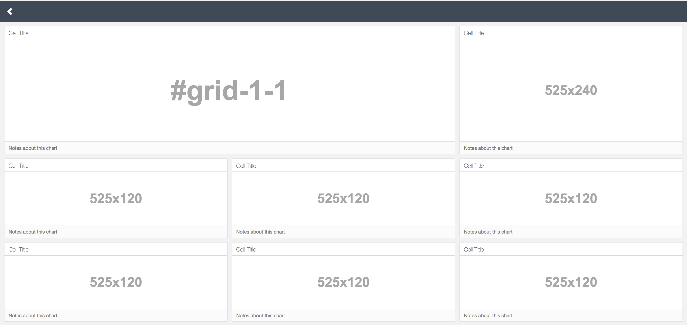
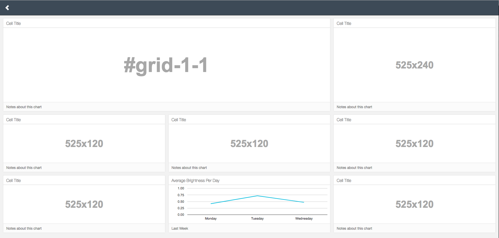

# Keen Dashboard

For most projects, it is super convenient, it not absolutely necessary, for a team to have a live dashboard of critical analytics.  The contents of the dashboard will vary by team and product, and even by where the product is at in its lifecycle (e.g., a startup might need to be focused on proving customer engagement with a new product to validate product-market fit, while a more established organization or product might need to be focused on improving a particular funnel conversion or monitoring product usage).  

Keen has a [Dashboard](https://github.com/keen/dashboards) framework (based on [Bootstrap](http://getbootstrap.com)) that is [Responsive](https://www.w3schools.com/html/html_responsive.asp) and convenient to use.  You can see some [Examples](http://keen.github.io/dashboards/examples/).

Essentially, we can render any of the standard Keen charts with our analytics data into any cell of the dashboard.

Please refer to the [Keen Dashboards](https://github.com/keen/dashboards) documention.

## LAMPI Dashboard

We will be using a Layout called "Hero-Thirds" - it looks something like:



The Django project has a new view and template for the dashboard, available at `/lampi/dashboard`.  To see the new view in action with some of the data we are collecting, add the following script to the bottom of **Web/lampisite/lampi/templates/lampi/dashboard.html** (be sure to fill in the **Project ID** and **Read Key** for your Keen Account):

```html
<script>

var client = new Keen({
  projectId: "FILL IN YOUR PROJECT ID",
  readKey: "FILL IN YOUR READ KEY"
});

  // Average Brightness By Day

  var average_brightness = new Keen.Dataviz()
    .el("#chart-07")
    .type('linechart')
    .height(190)
    .title("Average Brightness by Day")
    .notes("Previous two weeks")
    .prepare();

  client
    .query('average', {
        event_collection: 'devicestate',
        filters: [
            {
                "operator": "eq",
                "property_name": "state.on",
                "property_value": true
            }
        ],
        group_by: [
            "timestamp.info.day_of_week_string"
        ],
        target_property: "state.brightness",
        timeframe: "this_7_days",
        })
    .then(function(res) {
        average_brightness
            .data(res)
            .render();
    });

</script>
```

This creates a `'linechart'` in the HTML element with the `id` of `'chart-07'`.  The second-to-last `<div>` on the page has `id="chart-07"`.  The `prepare()` starts an animated spinner, indicating that data is being loaded. 
 
The `client.query(...` intiates a query against the Keen database.  In this case, the query is to compute an `'average'` within the `'devicestate'` collection on `'state.brightness'` across all devcies for the last seven days, but only on devices that have were "on" (`"state.on"` `"eq"` to `"true"`).  The `query` is then executed (HTTP transactions with Keen). When the query is complete, the `.then` handler executes - in this case a simple anonymous function that updates the `average_brightness` Dataviz with the query result data (`res`) and then calls `render()` on the Dataviz.

The query might take a long time to execute, so this pattern asynchronously updates the HTML when the query has completed and the results are available.

Note: each "tile" of the dashboard has a placeholder image, autogenerated by [Holder.js](https://github.com/imsky/holder).  The image is overwritten by the Dataviz instance.




**NOTE:  it is okay if there are small differences in your chart colors, gaps between "tiles" in the dashboard, etc.**

Next up: [10.6 Assignment](../10.6_Assignment/README.md)

&copy; 2015-18 LeanDog, Inc. and Nick Barendt
