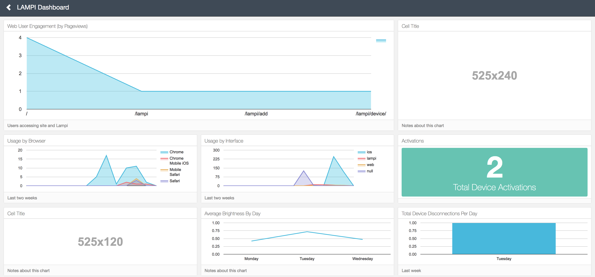
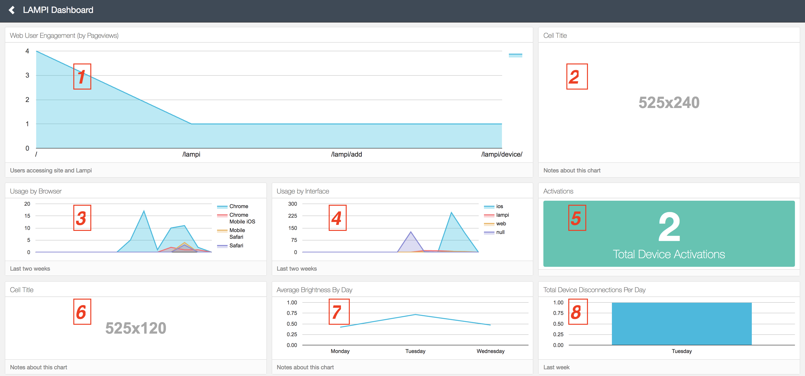

# Assignment

For this Assignment you will be instrumenting:

* Web Pages
* iOS
* `mqtt-daemon`

and building the following Dashboard:



(There are two blanks in the dashboard - we will be filling those in future assignments.)

The **dashboard.html** file and appropriate changes to **urls.py** and **views.py** are in the repository for you to start with, along with the assets that the Keen Dashboard relies on (Bootstrap, etc.). 

You should create a **dashboard.js** file in your static files, put all of your querying and charting code in there, and include that in **dashboard.html** with a `<script>` tag.

## Dashboard Charts

Please refer to the numbered view of the dashboard here for what should appear in each chart cell:

 

### Chart Types

| Cell # | Chart Type |
| ------ | ---------- | 
|    1   |  "area-step" |
|    2   |  - |
|    3   |  "area" |
|    4   |  "area" |
|    5   |  "metric" |
|    6   |  - |
|    7   |  "line" |
|    8   |  "bar" |

### Query Types

| Cell # | Collection | Query | Target/Actor | Time Frame | Notes  |
| --| ---------- | ----- | ------------ | ---------  | -----  |
| 1 | `pageviews`| [funnel](https://keen.io/docs/api/#funnels)| 'user.uuid'  | this\_14\_days | 3 [Steps](https://keen.io/docs/api/#steps) with the same `actor_property`, each with a different filter on `property_name` of 'url.info.path'. Step filters, in order (of the form `operator`:`property_value`): "eq":"/lampi/", "eq":"/lampi/add/", "contains":"/lampi/device/". (`inverted` and `optional` should both be `false`) |
| 2 |  -         |  -    |  -           | -            | Leave blank |
| 3 | `pageviews`| [count](https://keen.io/docs/api/#count) |              | this\_14\_days | group by "tech.browser.family" interval "daily" |  
| 4 | `ui`       | [count](https://keen.io/docs/api/#count) |              | this\_14\_days | group by "lampi.ui" interval "daily" |
| 5 | `activations`| [count\_unique](https://keen.io/docs/api/#count-unique) | 'device\_id'  | this\_10\_years| set title on chart; set color "#49c5b1" |
| 6 |  -         |  -    |  -           | -            | Leave blank |
| 7 | `devicestate`| [average](https://keen.io/docs/api/#average) | 'state.brightness' | this\_7\_days| filter "state.on" is True group by "timestamp.info.day\_of\_week\_string"|
| 8 | `devicemonitoring`| [count](https://keen.io/docs/api/#count) |  | this\_7\_days| filter "service" is "mqttbridge" and "state" is "disconnected" group by "timestamp.info.day\_of\_week\_string"|

Don't forget to add "Titles" and "Notes" for each, based on the images above.

**NOTE:  Your dashboard should generally look like the images here, but, it is okay if there are small differences in your chart colors, gaps between "tiles" in the dashboard, etc.**  

## Instrumentation

You will need to add instrumentation (event recording) to the Web, iOS, and MQTT systems.

## Web

There are two parts to this:

1. The Keen Auto Collector (hint: put it in a template so the whole site gets covered) - this will automatically create and populate the following collections: `pageviews`, `clicks`, and `form_submissions` with Keen default properties
1. Detailed tracking of UI events in `lampi.js` - you will need to instrument the the sliders and buttons; events from 'click', 'change', and 'input' UI should be stored in a collection named `ui` (the details of the properties for events in the `ui` collection are below).  Use [keen-tracking.js](https://github.com/keen/keen-tracking.js) for this (in addition to the Auto Collector).

Do not worry about the volume of analytics events at this point (e.g., fine if many events are generated as a slider is moved).  Do not worry about instrumenting the Dashboard page.

## iOS

Instrument the LAMPI iOS application with UI events for sliders and the button.  Events should be stored in the `ui` collection (the details of the properties for events in the ui collection are below)..

Again, do not worry about the volume of analytics events at this point.

## `mqtt-daemon`

The `mqtt-daemon` should track:

* Device Activations (as in the Courseware) in the `activations` collection.
* Device State (as in the Courseware) in the `devicestate` collection.
* Device Broker Bridge Connections and Disconnection in the `devicemonitoring` collection

## Event Collections

Events stored in a collection should generally have many properties in common, otherwise it becomes very difficult to pose queries.  Equivalently, if you find events with diverging sets of properties, it probably makes sense to store them in different collections..

The collections you will be populating with events are:

* `pageviews`
* `clicks`
* `form_submissions`
* `ui`
* `activations`
* `devicestate`
* `devicemonitoring`

## `pageviews`, `clicks`, `form_submissions`

`pageviews`, `clicks`, `form_submissions` are all default Keen collections populated by the Keen Auto Collector, and the default properties are fine..

## `ui`

Events in the `ui` collection will be coming from multiple sources (web, iOS, and from Kivy in the future).  

All `ui` events should have the following properties:

* "lampi"
    * 'ui' - a value of "web" or "ios"
    * 'device\_id' - the current device the user is interacting with
* "element"
    * "id" - one of "hue-slider", "saturation-slider", "brightness-slider" or "power"
    * "value" - the current value of the element (a floating point value for sliders, a boolean for the Power button

`ui` events from iOS should also have detailed "keen.location.coordinates" values.

`ui` events from the Web should have the same properties as events recorded by the Keen Auto Collector in the `clicks` collection (this might require some Keen add-ons ....).

Here is a sample `ui` event from the Web:

```json
{
  "user_agent": "Mozilla/5.0 (Macintosh; Intel Mac OS X 10_12_2) AppleWebKit/602.3.12 (KHTML, like Gecko) Version/10.0.2 Safari/602.3.12",
  "tracked_by": "lampi.js",
  "geo": {
    "province": "Ohio",
    "city": "Cleveland",
    "country": "United States",
    "coordinates": [
      -81.6053,
      41.5074
    ],
    "postal_code": "44106",
    "country_code": "US",
    "continent": "North America"
  },
  "time": {
    "utc": {
      "millisecond": 768,
      "day_of_week_string": "Sunday",
      "hour": 23,
      "timezone_offset": 0,
      "day_of_month": 7,
      "day_of_week": 7,
      "month": 5,
      "second": 54,
      "week": 18,
      "year": 2017,
      "minute": 16
    },
    "local": {
      "millisecond": 767,
      "day_of_week_string": "Sunday",
      "hour": 23,
      "timezone_offset": 0,
      "day_of_month": 7,
      "day_of_week": 7,
      "month": 5,
      "second": 54,
      "week": 18,
      "year": 2017,
      "minute": 16
    }
  },
  "lampi": {
    "ui": "web",
    "device_id": "b827ebfef9da"
  },
  "element": {
    "id": "hue-slider",
    "value": 0.74
  },
  "keen": {
    "timestamp": "2017-05-07T23:16:54.768Z",
    "created_at": "2017-05-07T23:16:54.259Z",
    "id": "590faae607271907caf7c62f"
  },
  "tech": {
    "device": {
      "family": "Other"
    },
    "profile": {
      "cookies": true,
      "name": "Netscape",
      "language": "en-us",
      "screen": {
        "orientation": {
          "type": "landscape",
          "angle": 0
        },
        "width": 1440,
        "availHeight": 827,
        "height": 900,
        "availWidth": 1440,
        "colorDepth": 24,
        "pixelDepth": 24
      },
      "platform": "MacIntel",
      "window": {
        "width": 1243,
        "ratio": {
          "width": 0.86,
          "height": 0.8
        },
        "scrollHeight": 673,
        "height": 665
      },
      "version": "5.0 (Macintosh; Intel Mac OS X 10_12_2) AppleWebKit/602.3.12 (KHTML, like Gecko) Version/10.0.2 Safari/602.3.12",
      "online": true,
      "useragent": "Mozilla/5.0 (Macintosh; Intel Mac OS X 10_12_2) AppleWebKit/602.3.12 (KHTML, like Gecko) Version/10.0.2 Safari/602.3.12",
      "codeName": "Mozilla"
    },
    "os": {
      "major": "10",
      "patch_minor": null,
      "minor": "12",
      "family": "Mac OS X",
      "patch": "2"
    },
    "browser": {
      "major": "10",
      "minor": "0",
      "family": "Safari",
      "patch": "2"
    }
  },
  "url": {
    "info": {
      "path": "/lampi/device/b827ebfef9da",
      "domain": "ec2-34-199-107-106.compute-1.amazonaws.com",
      "protocol": "https",
      "anchor": null
    },
    "full": "https://ec2-34-199-107-106.compute-1.amazonaws.com/lampi/device/b827ebfef9da"
  },
  "referrer": {
    "info": {
      "path": "/",
      "domain": "ec2-34-199-107-106.compute-1.amazonaws.com",
      "protocol": "https",
      "anchor": null
    },
    "full": "https://ec2-34-199-107-106.compute-1.amazonaws.com/"
  },
  "local_time_full": "2017-05-07T23:16:54.767Z",
  "ip_address": "192.5.110.4",
  "page": {
    "description": "LAMPI Control for b827ebfef9da",
    "title": "LAMPI"
  },
  "user": {
    "uuid": "dcc57776-0d53-40c4-8791-53228cd6d9da"
  }
}
```

## `activations`

Events in the `activations` collection should be as per the Courseware example.

Here is an example:

```json
{
    "keen": {
        "timestamp": "2017-03-22T14:44:29.019Z",
        "created_at": "2017-03-22T14:44:29.201Z",
        "id": "58d28dcd80a7bd1c2c1253b3"
    },
    "user": "parked_device_user",
    "timestamp": {
        "info": {
            "millisecond": 19,
            "day_of_week_string": "Wednesday",
            "hour": 14,
            "timezone_offset": 0,
            "day_of_month": 22,
            "day_of_week": 3,
            "month": 3,
            "second": 29,
            "week": 12,
            "year": 2017,
            "minute": 44
        }
    },
    "device_id": "b827eb08451e"
}    
```

Event Records should be generated for both the Device being connected the first time, as well as when the user adds the device to their account (with different values for "user" in the event Record).

## `devicestate`

Events in the `devicestate` collection should be as per the Courseware example.

Here is an example:

```json
{
    "keen": {
        "timestamp": "2017-03-22T14:54:04.925Z",
        "created_at": "2017-03-22T14:54:05.107Z",
        "id": "58d2900ddc7713688ad4121e"
    },
    "state": {
        "color": {
            "h": 0.44,
            "s": 1
        },
        "on": true,
        "client": "lamp_ui",
        "brightness": 0.47058823529411764
    },
    "timestamp": {
        "info": {
            "millisecond": 925,
            "day_of_week_string": "Wednesday",
            "hour": 14,
            "timezone_offset": 0,
            "day_of_month": 22,
            "day_of_week": 3,
            "month": 3,
            "second": 4,
            "week": 12,
            "year": 2017,
            "minute": 54
        }
    },
    "device_id": "b827eb08451e"
}    
```


## `devicemonitoring`

When a LAMPI's MQTT Broker bridge connection is made or broken, an Event should be created in the `devicemonitoring` collection.

Basic Keen and timestamp properties should be on each event, as well as:

* "service" - "mqttbridge"
* "state" - "connected" or "disconnected"
* "device\_id" - the device's Device ID

Here is an example:

```json
{
    "keen": {
        "timestamp": "2017-03-22T00:41:35.524Z",
        "created_at": "2017-03-22T00:41:35.703Z",
        "id": "58d1c83f420f9a7a8a389590"
    },
    "state": "connected",
    "timestamp": {
        "info": {
            "millisecond": 524,
            "day_of_week_string": "Wednesday",
            "hour": 0,
            "timezone_offset": 0,
            "day_of_month": 22,
            "day_of_week": 3,
            "month": 3,
            "second": 35,
            "week": 12,
            "year": 2017,
            "minute": 41
        }
    },
    "service": "mqttbridge",
    "device_id": "b827eb08451e"
}    
```

## Liveness

Refreshing the Dashboard should demonstrate that new events are being recorded and are showing up in the query sets and charts (e.g., visiting a page on your site, using the iOS application to control the lamp, etc.).

## What to Turn in 

You need to turn in the following:

1. A short (a few sentences) write up from each member of the pair summarizing what they learned completing the assignment, and one thing that surprised them (good, bad, or just surprising).  This should in **connected-devices/writeup.md** in [Markdown](https://daringfireball.net/projects/markdown/) format.  You can find a template file in **connected-devices/template\_writeup.md**
2. A Git Pull Request
3. A short video demonstrating the required behaviors emailed to the instructor and TA.  The video should be named **[assignment 3]_[LAST_NAME_1]\_[LAST_NAME_2].[video format]**.  So, for this assignment, if your pair's last names are "Smith" and "Jones" and you record a .MOV, you would email a file named ```2_smith_jones.mov``` to the instructor.
4. A live demo at the beginning of the next class - **be prepared!**

Notes:

* Each pair must have a Mac with Xcode and an iOS device between them.


&copy; 2015-18 LeanDog, Inc. and Nick Barendt
